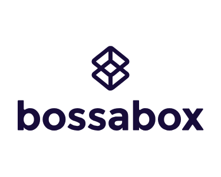

<h1 align="center">
    
</h1>

<p align="center">
  

  

  <a href="https://github.com/leocairos/vuttr-backend/commits/master">
    
  </a>

  
   <a href="https://github.com/leocairos/vuttr-backend/stargazers">
    
  </a>

  <a href="https://www.linkedin.com/in/leonardo-sampaio-cairo-54a74756/">
    
  </a>
</p>

# VUTTR API

This respository has a simple API to BossaBox challenge backend.

Require:
  * NodeJS v14.16.0+
  * Docker
  * yarn (optimal)

## How to execute

* Clone this repository
* Install docker
* Update Dockerfile file in root path project
* Build a docker image file (run in root path project):
  ```bash
  docker build -t vuttr .
  ```
* run migrations:
  ```bash
  yarn typeorm migration:run
  ```
* Update a docker-compose.yml file
* run compose:
  ```bash
  $ docker-compose up (with -d to background run)
  ```

## API Documentation

Run project and open API Doc in http://[addressServer]:[portServer]/[api-doc-route-path] (ex: http://localhost:3000/api-docs)

### Routes

This API has routes:

* `GET /tools` : List all tools
  * To filter by tag field, use query `?tag=busca`
* `POST /tools` : Create a new toolcria uma nova ferramenta
* `DELETE /tools/:id` : Delete a tool by id


## Roadmap

**Basic**
- [X] An application containing a real simple API, without authentication, that meets the requirements described below, making requests to a database for persistence;
- [X] README.md containing basic information about the project and how to execute it;
- [X] API Blueprint or Swagger of the application

**Bonus**
- [X] Use of external tools to facilitate your work;
- [X] Special care with optimization, standards, among others;
- [X] Migrations or script to configure the database used;
- [X] Tests (unitary, integration);
- [X] Containerization of the application;
- [ ] Authentication and authorization (OAuth, JWT);
- [ ] CI / CD pipelines (GitLab, CircleCI, TravisCI, etc.);
- [ ] Deploy in real environments, using external cloud services (AWS, Heroku, GCP, etc.);
- [ ] Suggestions about the challenge based on some argument.


## 📝License

 Code released under the [MIT License](https://github.com/leocairos/vuttr-backend/blob/main/LICENSE).

Make with ❤️ by [Leonardo Cairo](https://www.linkedin.com/in/leonardo-sampaio-cairo-54a74756/)!
